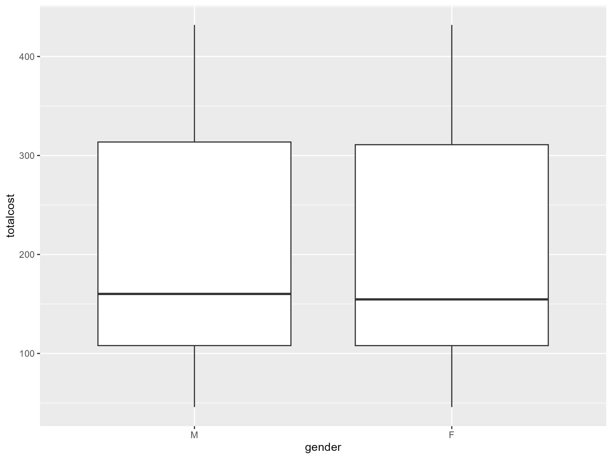

title: "Acute Bronchitis Cost Analysis"
format: html
df-print:kable
execute: 
  echo: true
  warning: false
  message: false
---

##Introduction 
This report primalry investigates wheter total medication coast for Acute bronchitis differs for males and females, 
we will also cover subanalysis of the average medication coast, the distribution of healthcare expenses across income and the average base cost. 


## Load packages

```{r}
library(dplyr)
library(ggplot2)
library(janitor)
library(tidyverse)
library(data.table)
library(zip)
library(rvest)
library(fs)
library(targets)
library(tarchetypes)
library(labelled)
library(knitr)
library(gt)
``` 

```qmd
Starting with looking at the linked data file and the variables we are about to work with
``` 


 ```{r} 
colnames(data_linked)

``` 

```qmd
What is the average medication cost for all individuals with the diagnostis and the total medication cost?
```

```{r}

summary_table_totalcost <- data_linked |>
  summarise(
    `Sum of Total Cost` = round(sum(totalcost, na.rm = TRUE), 2),
    `Average Total Cost` = round(mean(totalcost, na.rm = TRUE), 2)
  )

kable(summary_table_totalcost, caption = "Summary of total medication cost")
``` 

```qmd
How much does the total medication cost differ between genders?
 
``` 

```{r}
#Distribution of genders 
plot1 <- ggplot(data_linked, aes(x = gender, y = totalcost)) +
  geom_boxplot()
plot1

``` 

```qmd
what is the distribution of healthcare expenses across income?

The figure below shos the realationship between income and healtcare expenses 
``` 
```{r}
ggplot(data_linked, aes(x=income, y=healthcare_expenses)) + 
    geom_point() + 
    labs(
        x="Income",
        y= "Healtcare expenses",
        title = "Healtcare expenses vs income "
    )

``` 
```qmd
Distribution of healtcare expenses 
``` 
```{r}
ggplot(data_linked, aes(x=healthcare_expenses)) + 
    geom_histogram(bins=30) +
    labs(
        title= "Distribution of healthcare expenses cost for persons with Acute bronchitis",
        x="Total Medication cost",
        y="counts"
    ) + 
        theme_minimal()
``` 

```qmd
 Distribution of income
``` 
```{r}
ggplot(data_linked, aes(x=income)) + 
    geom_histogram(bins=30) +
    labs(
        title= "Distribution of income",
        x="income",
        y="counts"
    ) + 
        theme_minimal()
```

```qmd
 oxplots 
```

```{r}
ggplot(data_linked, aes(y=healthcare_expenses)) +
    geom_boxplot() +
    labs(
    y="Boxplot of Healtcare expenses") +
        theme_minimal()

    ggplot(data_linked, aes(y=income)) +
    geom_boxplot() +
    labs(
    y="Boxplot of income") +
        theme_minimal()
``` 

```qmd
we can detect that the data is heavenly right-tailed for both the income and the healtcare expenses. The distribution is skewed possibly becuase we have a lot of outliers, 
meaning that some individuals has high values and that higly affects the distribution. income may influence healtcare expenses becuase different incomes may cuase different acces to care and different oportunities for which medications a person can get. 
Healcare expenses may also directly contribute to the total coast of the disease. 

Overall the results suggest that income and healtcare expenses might influence the total cost
``` 

